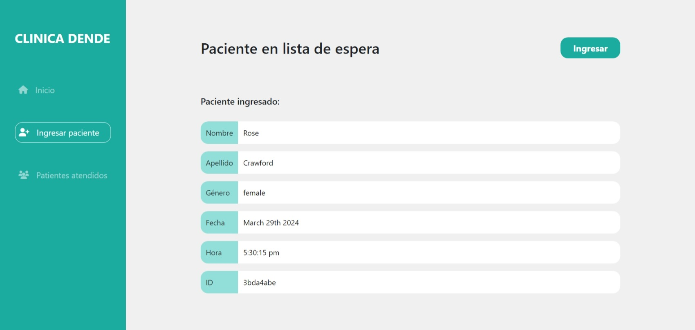
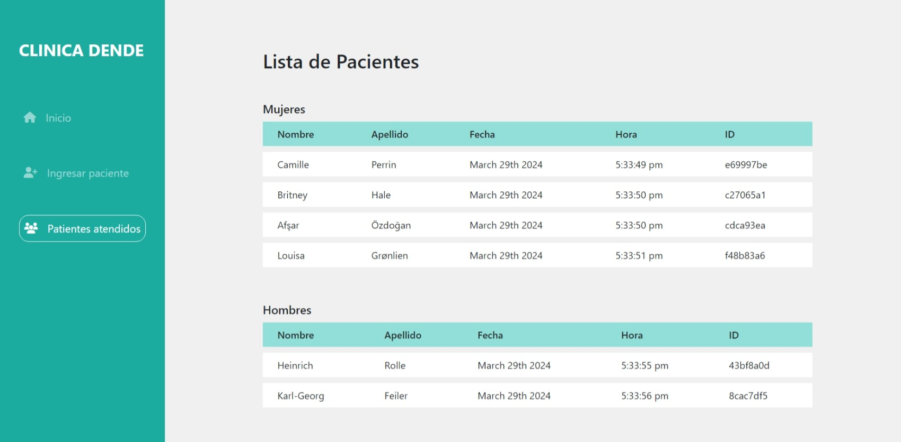
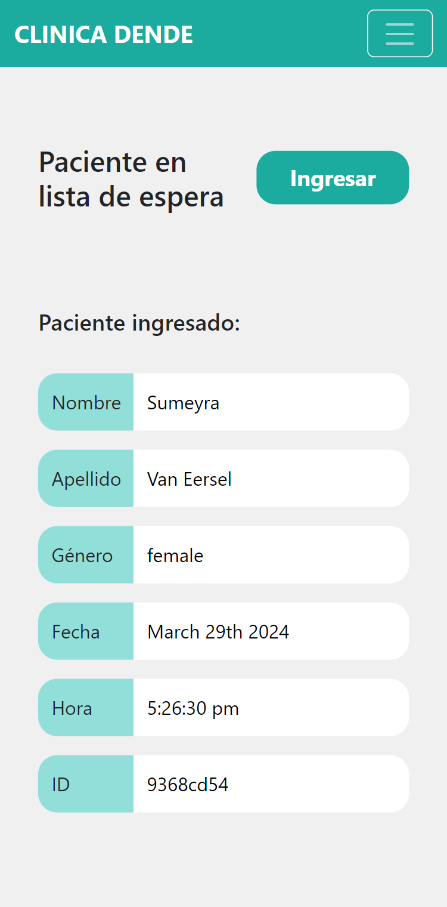
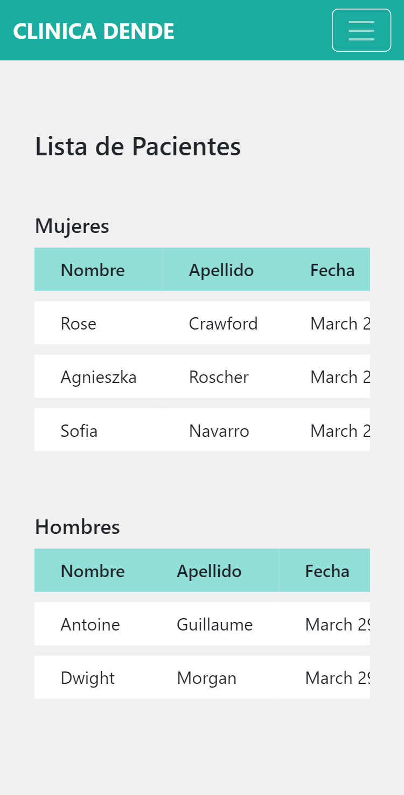

# Desafío - Citas médicas

Este es un gestor simple de pacientes desarrollado con Express.js que permite agregar pacientes nuevos, listar pacientes y ver detalles de los mismos.

## Screenshot









## Objetivos

- Validar los conocimientos de manejo de dependencias y el uso de paquetes en Node.  
- Uso de NPM con paquetes que no procesan datos y NPM diseñados específicamente para el procesamiento de datos. 

## Estructura de Archivos

- index.js: Archivo principal que configura el servidor Express.
- app.js: Archivo que configura la aplicación Express y el motor de plantillas Handlebars.
- routes.js: Archivo que define las rutas y controladores para manejar las solicitudes HTTP.

## Dependencias Usadas
- Express.js: Framework web para Node.js.
- Express Handlebars: Motor de plantillas para Express.
- Axios: Cliente HTTP para realizar peticiones a la API de usuarios aleatorios.
- UUID: Para generar identificadores únicos.
- Moment.js: Para formatear fechas y horas.
- Lodash: Utilizado para particionar la lista de pacientes por género.
- Chalk: Para colorear la salida en la consola.

## Instalación y Ejecución

1. Clona este repositorio en tu máquina local.


2. Instala las dependencias:
```
npm install express axios moment lodash chalk express-handlebars uuid
```

3. Iniciar el Servidor con npm run dev.

4. Abre tu navegador web y ve a http://localhost:3000.

